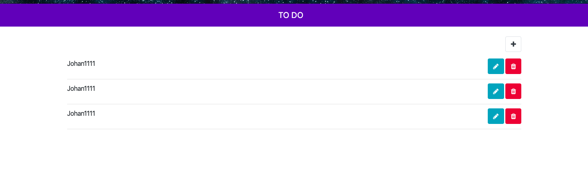

# Requirements.

node and npm

# Installation

Clone the repository and Install the application: `npm install`

## Development server

Run `ng serve` for a dev server. Navigate to `http://localhost:4200/`. The app will automatically reload if you change any of the source files.

